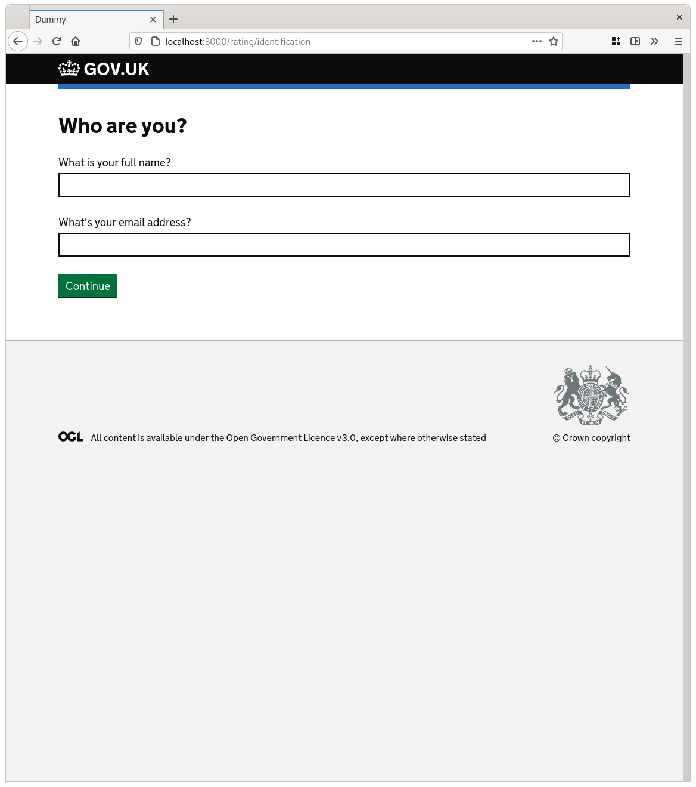
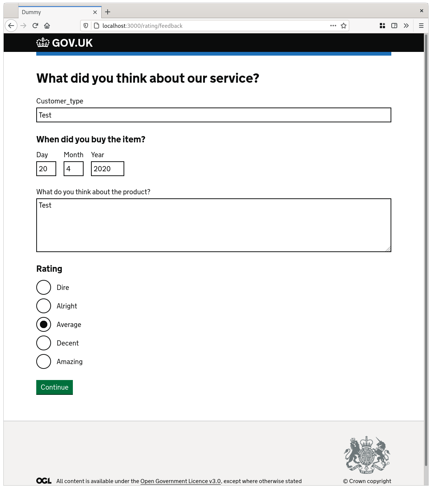

# Wizardry 🧙

This gem for Rails allows application writers to define a GOV.UK wizard
(multi-page form) in one place.

**Note this library is at the very early stages of development. It's not
properly tested and is very likely to change**.

## Things the library does:

* renders the wizard pages based on the specification ✔
* correctly annotates the pages using Rails' I18n functionality ✔
* deals with form submissions ✔
* applies contextual validation on a per-page basis and displaying error messages ✔

## Things the library will do, eventually

* provide a callbacks upon step and wizard completion
* allow conditional logic to customise the path through the journey
* let developers override pages and questions with their own partials
* allow for extra customisation over the size of labels, legends and captions

## How does it work?

The wizard relies on the application having a single model that will hold the
collected data. Each question in the wizard maps to a field and every page
maps to a [validation context](https://guides.rubyonrails.org/active_record_validations.html#on).

Throughout the process the last completed step is recorded in the model. It's
used to track progress and hold the state of the response. It is automatically
updated when a successful submission is made.

### Example

Just include the `Wizardry` module in your controller and use the `wizard` macro
to define your pages and questions:

```ruby
class RatingsController < ApplicationController
  include Wizardry

  wizard name: 'ratings',
    class_name: 'Rating',
    edit_path_helper: :ratings_page_path,
    update_path_helper: :ratings_path,
    pages: [
      Wizardry::Pages::Page.new(
        :identification,
        title: 'Who are you?',
        questions: [
          Wizardry::Questions::ShortAnswer.new(:full_name),
          Wizardry::Questions::EmailAddress.new(:email)
        ]
      ),
      Wizardry::Pages::Page.new(
        :feedback,
        title: 'What did you think about our service?',
        questions: [
          Wizardry::Questions::ShortAnswer.new(:customer_type),
          Wizardry::Questions::Date.new(:purchase_date),
          Wizardry::Questions::LongAnswer.new(:feedback),
          Wizardry::Questions::Radios.new(:rating, {
            1 => 'Dire', 2 => 'Alright', 3 => 'Average', 4 => 'Decent', 5 => 'Amazing'
          })
        ]
      ),
      Wizardry::Pages::CheckYourAnswersPage.new,
    ]
end
```

### Routes

In the example above, we're providing the `edit_path_helper` and
`update_path_helper` values. These are the Rails path helpers that correspond
with the path that displays the current page of the wizard and the path that
updates the object.

```ruby
Rails.application.routes.draw do
  get %(rating/:page), to: %(ratings#edit), as: :ratings_page
  patch %(rating/:page), to: %(ratings#update), as: :ratings
end
```

### Rendering

To add the wizard content to your `edit` template, the gem comes with a
`wizardry_content` helper. Additionally, the wizard object is available for the
developer to interact with in the `@wizard` instance variable. Here we are
using it to set the heading.

```erb
<h1 class="govuk-heading-l"><%= @wizard.current_page.name.capitalize %></h1>

<%= wizardry_content %>
```

### Special pages

Most pages in a wizard are ones that ask questions. Many wizards also contain a
[check your answers](https://design-system.service.gov.uk/patterns/check-answers/) page and
a page that's displayed upon completion. These are both **in scope** for this
gem.

### Preview

| Page one | Page two |
| -----------------| ---------- |
|  |  |
